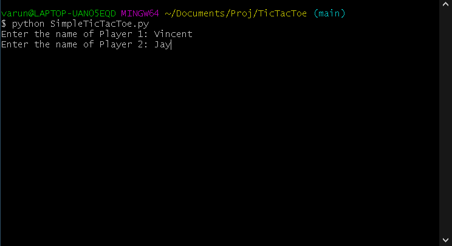
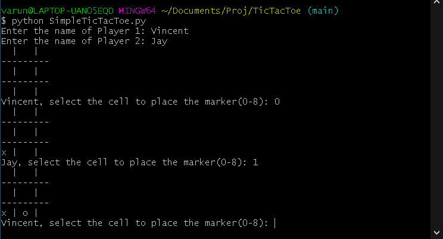
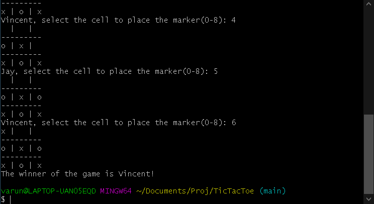
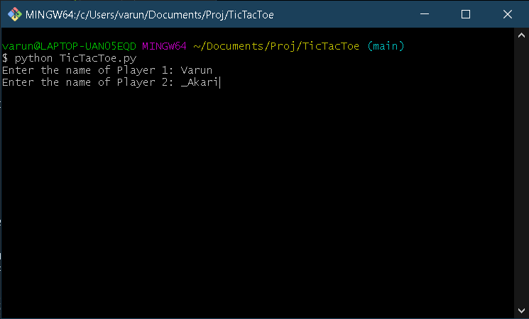

# TicTacToe

Play a simple game of TicTacToe on the command line

## How to play

### 1) SimpleTicTacToe

1. Download and execute the `SimpleTicTacToe.py` file in command prompt.
2. A message will pop up on the terminal asking for the player names. Player 1 will have the 'x' marker and player 2 will have the 'o' marker.

   

3. Now, players have to take turns and place their markers on the cells. To do this the player has to type an integer from 0-8 to place their marker at the corresponding position. The Cell position mapping is shown below.

   ```console
   6 | 7 | 8
   ---------
   3 | 4 | 5
   ---------
   0 | 1 | 2
   ```

   

4. The game continues until a winner is decided or if a player cannot make a move. If a player wins the game, their name will be announced as the winner.

   

   If there a player cannot make any further moves and there is no winner, the game is declared as a draw.

---

### 2) TicTacToe

In this version of TicTacToe, you can play against the bots that are implemented in the game.

Here are the list of bots implemented so for:

- _Akari

1. To play, execute the `TicTacToe.py` file on the terminal.
2. A message will pop up asking for the player names. If you wish to play with a bot, just type the name of the bot as the player name, and the bot will play for the respective side.

   

3. You can play the rest of the game while the bot makes its moves and the winner will be declared at the end of the match.

---

## Contributors

- Varun Teja A. <https://github.com/VarunAkav>
